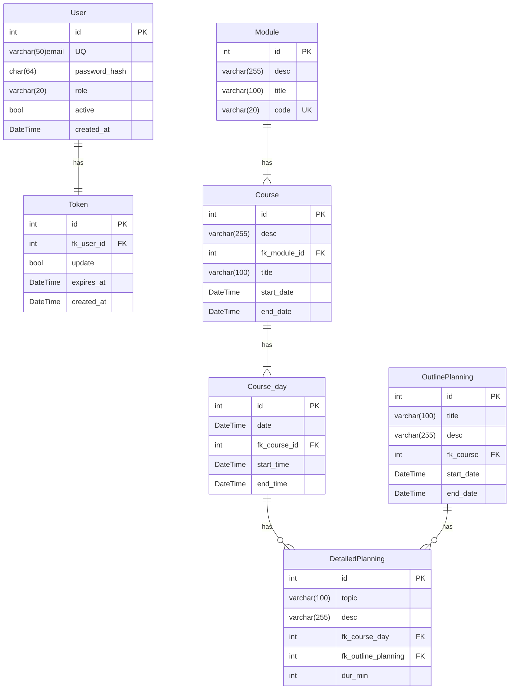

<!--
||--||   one to one
||--o{   one to zero-or-many
||--|{   one to one-or-many
o|--o{   zero-or-one to zero-or-many
-->

```mermaid
erDiagram
    User ||--|| Token : has
    Module ||--|{ Course : has
    Course ||--|{ Course_day : has
    Course_day ||--o{ DetailedPlanning : has
    OutlinePlanning ||--o{DetailedPlanning : has

    User{
        int id PK
        varchar(50)email UQ
        char(64) password_hash
        varchar(20) role
        bool active
        DateTime created_at
    }
    Token {
        int id PK
        int fk_user_id FK
        bool update
        DateTime expires_at
        DateTime created_at
    }
    
    Module {
        int id PK
        varchar(255) desc
        varchar(100) title
        varchar(20) code UK
    }
    
    Course {
        int id PK
        varchar(255) desc
        int fk_module_id FK
        varchar(100) title
        DateTime start_date
        DateTime end_date
    }
    
    Course_day {
        int id PK
        DateTime date
        int fk_course_id FK
        DateTime start_time
        DateTime end_time
    }
    OutlinePlanning {
        int id PK
        varchar(100) title
        varchar(255) desc
        int fk_course FK
        DateTime start_date
        DateTime end_date
       }
   
    DetailedPlanning {
        int id PK
        varchar(100) topic
        varchar(255) desc
        int fk_course_day FK
        int fk_outline_planning FK
        int dur_min
       }
    
```
